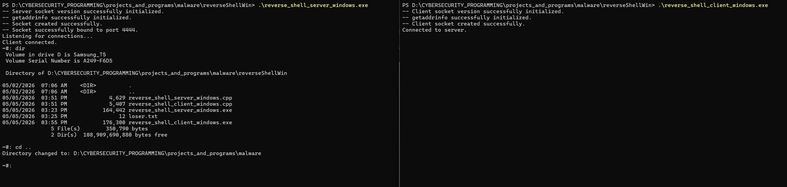

# Malware

This repository contains malware programs for ethical hacking purposes.

### 1. Windows Keylogger v1 (C++)
`keylogger_windows.cpp`

A command-line tool that:
- Creates a data.txt file in the local directory;
- Logs all keystrokes until program is closed.

**Usage:**
```bash
g++ keylogger_windows.cpp -o keylogger_windows.exe
keylogger_windows.exe
```

### 2. Windows Credential Stealer v1 (C++)
`credential_stealer_windows.cpp`

A command-line tool that:
- Creates a data.txt file in the local directory;
- Steals all credential data from the Credentials Manager application.

**Usage:**
```bash
g++ credential_stealer_windows.cpp -o credential_stealer_windows.exe
credential_stealer_windows.exe
```

### 3. Windows Reverse Shell v1 (C++)
`reverse_shell_server_windows.cpp`, `reverse_shell_target_windows.cpp`

A command-line tool that:
- Establishes a TCP socket connection between server and target.
- Allows the server to enter powershell commands that are executed on target machine, sending all output back to server without displaying it to target.

**Usage:**
```bash
g++ .\reverse_shell_target_windows.cpp -o .\reverse_shell_target_windows.exe -lws2_32
g++ .\reverse_shell_server_windows.cpp -o .\reverse_shell_servers_windows.exe -lws2_32
.\reverse_shell_target_windows.exe
.\reverse_shell_servers_windows.exe
```


